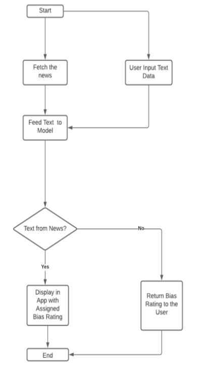
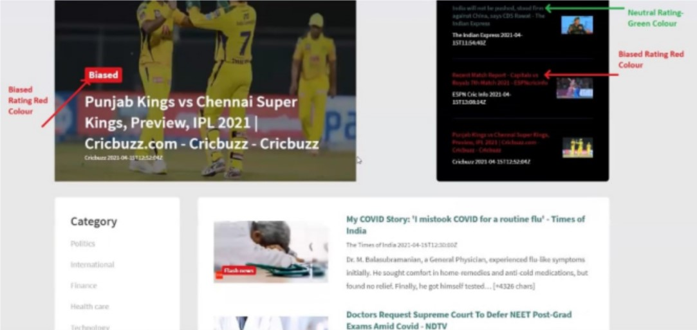
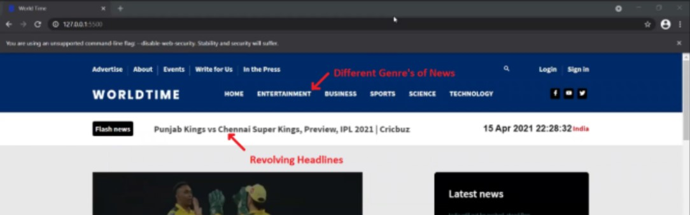

# NewsBiasDetection

An application that aggregates news articles and shows if the articles are biased or not.  
We use a custom model built on TensorFlow that uses BERT as the core model to identify the bias.  
The dataset the model is trained on is a custom dataset that was formed by assigning different news outlets specific biases after studying them. (Yes, it might involve our own biases, but we try to avoid this by cross-verifying the biases with multiple websites online!)

We use JavaScript for the UI and Flask for the backend.. 

## Flow

1. **Start**: Fetches news articles from selected sources.
2. **User Input Text Data**: Allows users to input their own text or fetch news articles from sources.
3. **Feed Text to Model**: Passes the input or fetched data to the BERT-based model for classification.
4. **Bias Detection**: The model detects and categorizes the level of bias present in the text.
5. **Display Results**: Shows the bias rating and relevant suggestions, if any.

## Screenshots

- **Example**: Categorized news bias displayed in user-friendly UI components.

